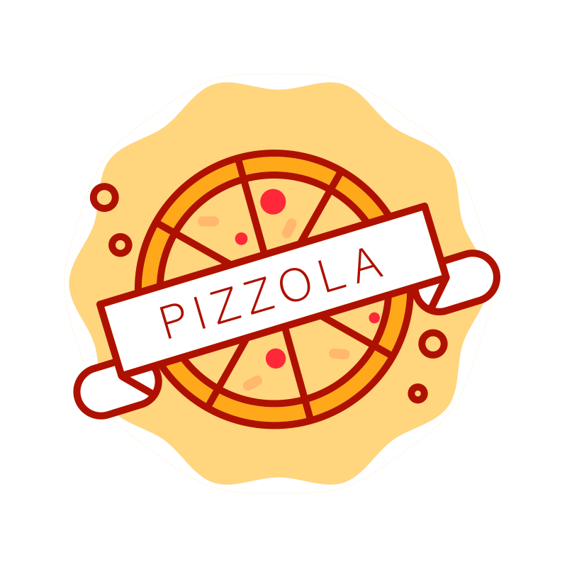

# Pizzola :pizza:

Este es el backend usado para pizzola usando nodejs y nginx.

### Dependencias
 
- node
- npm
- nginx

## Ejecutar el servidor

- configura el archivo `config.json`, puedes basarte en el `config.example.json`
- npm start

## Rutas de expressjs

GET `/menu`

Para obtener todos los items (pizzas) del menú.

POST `/menu`

Para publicar un item (pizza) en el menú

DELETE `/menu/:id`

Para eleminar un item (pizza) del menú.
